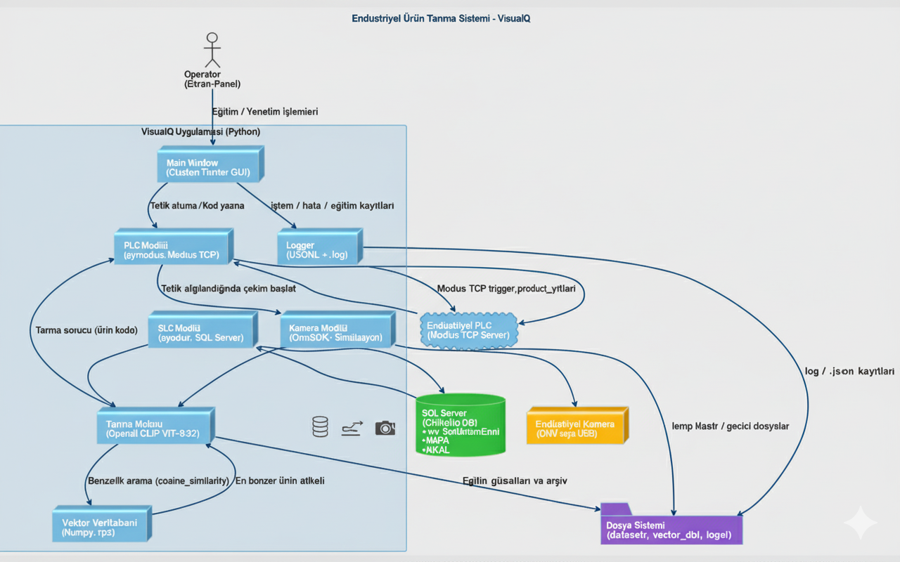

# 🌟 Highlight Project: VisualIQ – Industrial Product Recognition System

## 💡 Overview
VisualIQ is an **AI-powered industrial vision system** designed to automate product recognition and verification processes on production lines. It integrates high-speed camera acquisition, advanced AI analysis, and PLC communication for reliable, human-intervention-free production management.

### **Core Problem Solved**
Manual or barcode-based product verification is slow and error-prone. VisualIQ provides a high-speed, flexible solution for **product verification, labeling, and real-time production reporting** across diverse manufacturing environments.

## ⚙️ Technical Architecture

This system demonstrates expertise in **full-stack industrial integration**, bridging Python AI models with industrial hardware.

### **1. AI & Vision Pipeline**

* **Model:** **OpenAI CLIP (Contrastive Language–Image Pretraining) ViT-B/32** is used for robust visual recognition.
* **Self-Learning (Incremental Training):** New product images are collected automatically (`dataset/train/{ürün_kodu}`). Once sufficient data is gathered, the system notifies the operator for approval, triggering **incremental training** and integration into the **`clip_vector_db.npz`** vector database.
* **Data Scope:** Operates on an **active product list** retrieved from the `vw_SonUretimEmri` view in a **SQL Server** database, ensuring recognition is limited to currently relevant items.
* **Camera Interface:** Utilizes an optimized **DMV SDK** interface for high-speed industrial camera acquisition, with a dedicated simulation mode available.

### **2. Industrial Integration**

* **PLC Communication:** Receives a trigger signal from the PLC and transmits the identified product code back using the **Modbus TCP** protocol.
* **Software Stack:** Developed entirely on **Python + PyTorch**.

### **3. Operator Interface & Management**

The Human-Machine Interface (HMI) is built with **CustomTkinter** for a robust desktop experience, featuring:

* **Training Mode:** Manages automated new product image collection and approval-based model updates.
* **Active Products & Log Viewing:** Provides real-time tracking, error logs (JSONL format), and production statistics.
* **Management Panel:** Centralized control for system configuration.

## ✨ Key Technical Achievements

VisualIQ provides a high-speed, accurate, and sustainable industrial AI solution by seamlessly integrating **Camera – PLC – Database – Artificial Intelligence** into a single, manageable platform.

---

### ⚠️ IMPORTANT NOTE ON CODE ACCESS

This project is a high-value commercial application. Due to **proprietary agreements and commercial secrecy**, the source code is kept in a **private repository**.

If you are a serious hiring manager or technical lead, please feel free to contact me via **[Your Email/LinkedIn]** for a confidential technical discussion or a demonstration of the system's architecture and performance.
